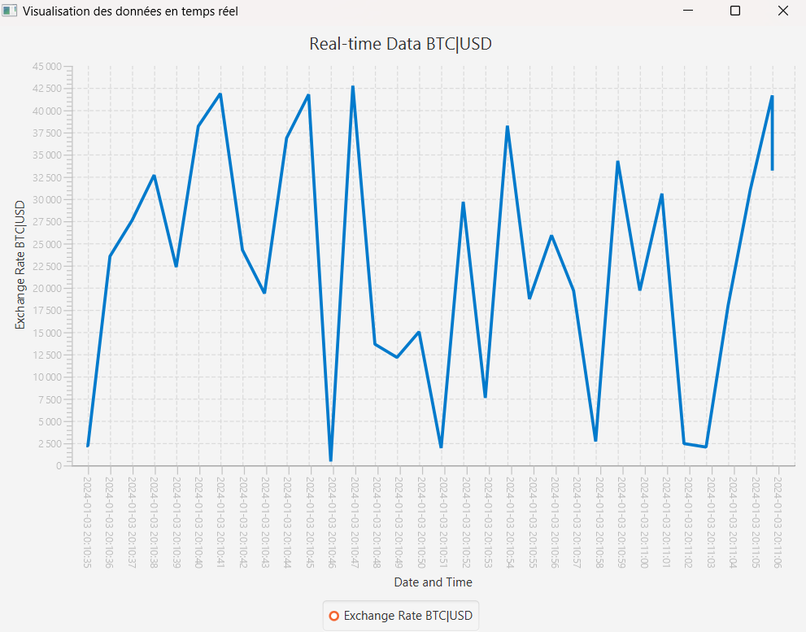

# Real-Time Stock Data Visualization Project with Sliding Windows

## CryptoStreamVis

    **Yosri Saadi

    **Chaima Skhiri

    **Haroun Mezrioui

The Real-Time Data Visualization project is designed to acquire live cryptocurrency exchange rate information, specifically focusing on the Bitcoin-to-USD rate, from the Binance API. This real-time data is then subjected to processing via Apache Flink to enable streaming analytics. The processed data is dynamically visualized using a line chart interface powered by JavaFX.

## Objectives:
1. Retrieve real-time Bitcoin-to-USD exchange rate data from the Binance API.
2. Process the streaming data in real-time using Apache Flink for analytics and transformative operations.
3. Implement sliding window operations to detect related data.
4. Visualize the processed data dynamically through a line chart interface developed using JavaFX.

## Usage:
1. Clone the project repository to your local machine.
2. Set up and run an environment compatible with Apache Flink.
3. Open the project in your preferred Integrated Development Environment (IDE).
4. Compile and execute the BitcoinChange class to start the Flink streaming job.
5. Monitor the console for updates on collected data.
6. Run the RealTimeDataVisualization class to launch the JavaFX graphical interface displaying the real-time BTC/USD exchange rate chart.
7. Ensure specific configurations such as API keys, necessary dependency downloads, and Flink environment settings are adjusted for the project to execute correctly.

## Explication:
- #### BitcoinChange.scala :
Scala file responsible for real-time data processing using Apache Flink.

Utilizes the BinanceAPI class as a data source to fetch Bitcoin/USD exchange rates in real-time.

Defines a sliding window of 10 seconds with a sliding interval of 5 seconds on the fetched exchange rates.

Prints aggregated windowed data to the console.

- #### BinanceAPI.scala :
Scala file containing the BinanceAPI class used as a data source within Apache Flink.

Implements SourceFunction[Double] to provide continuous Bitcoin/USD exchange rate data.

Inside the run method, it fetches real data from the Binance API at regular intervals and emits it via ctx.collect.

- #### RealTimeDataVisualization.java :
Java file with JavaFX code to create a real-time data display application.

Uses a JavaFX LineChart to display Bitcoin/USD exchange rates in real-time.

Utilizes a ScheduledExecutorService to periodically update chart data with simulated random values.

## Requirements:
- Java Development Kit (JDK) and Scala : Install JDK 11 or later versions.
- Apache Flink: Download and set up Apache Flink, ensuring compatibility with the chosen Java version.
- JavaFX: Ensure JavaFX is available in your Java installation or set up according to your IDE's requirements.
- Dependencies: Include necessary dependencies for Apache Flink and JavaFX in your project. For Flink, it's often managed via build tools like Maven or Gradle.
- Binance API Access: Obtain API keys from Binance for accessing real-time cryptocurrency exchange rate data.

## Sliding Windows:
The sliding window operation is utilized to segment the incoming stream of cryptocurrency exchange rate data into discrete intervals, allowing for the analysis of data over defined time windows. By specifying a window size of 10 seconds and a sliding interval of 5 seconds, this approach facilitates the examination of exchange rate values within these time-based windows.

The filtering step preceding the windowing operation narrows down the data stream, considering only values exceeding 1000, likely focusing on specific criteria or noteworthy values for analysis.

Additionally, the subsequent reduction operation, employing summation within each window, enables the extraction of aggregated insights or computations within these temporal segments, aiding in real-time analytics and decision-making processes. Overall, this methodology of sliding windows, filtering, and aggregating data fosters a structured approach to analyze real-time cryptocurrency exchange rate information, enabling more granular insights and dynamic analytics.

